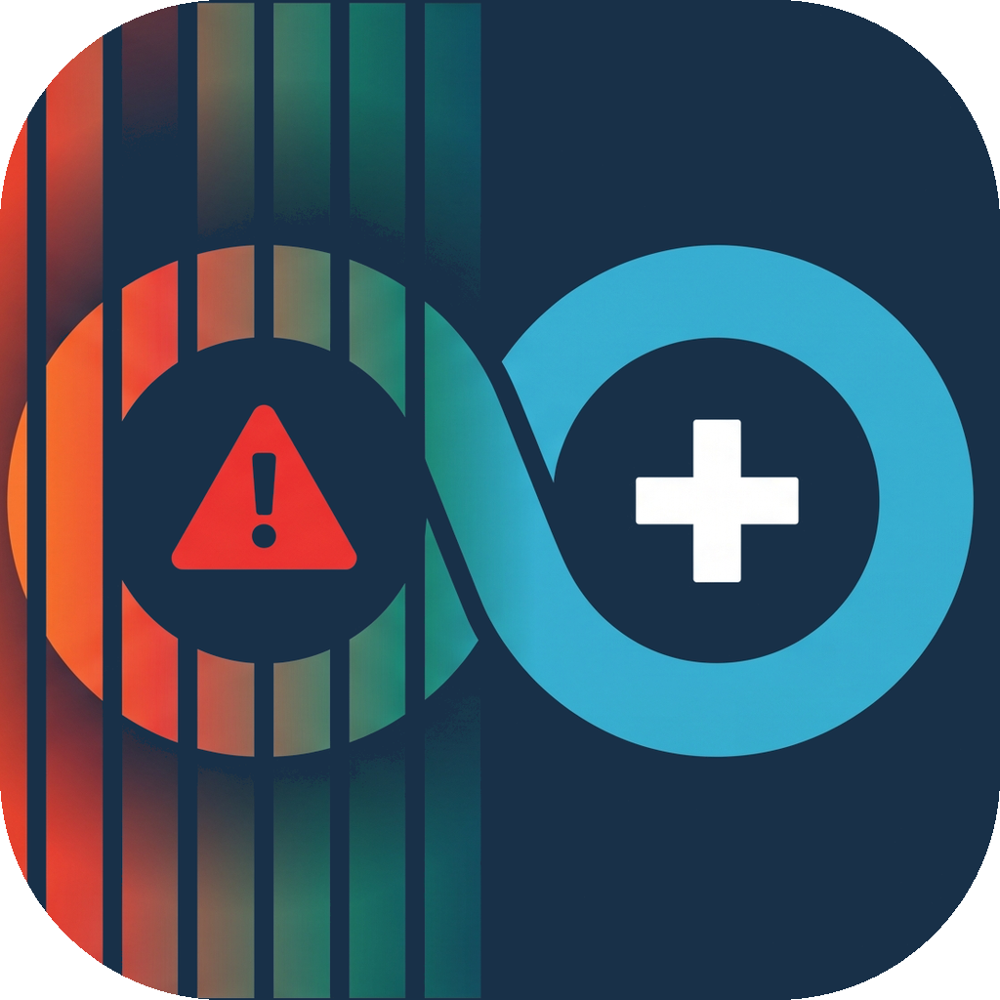

# Blinko

**Read a microcontroller's logs with a phone camera, through its LEDs.**

The board blinks its on-board LEDs; you point a phone at it and the messages
appear on the screen. No cable, no radio, no pairing, no extra hardware: the
LED that is already on the board is the transmitter, the camera that is already
in your pocket is the receiver.

It also works when the board is dead. A hard fault, a failed assert or a
watchdog reset ends in a handler that needs no interrupts, no kernel and no
drivers: it blinks the reason on the red LED until you press reset, and writes
it to flash so the next boot can repeat it. A board that cannot talk on serial
any more can still tell you *why* it stopped.

## How it works

A CMOS camera does not expose the whole sensor at once: it exposes one row
after another, top to bottom. A LED blinking much faster than the frame rate is
therefore seen at a different instant by every row, and one frame comes out
striped. **The vertical axis of the image is a time axis**, at about 5 µs per
row on a modern phone, which is 200 kHz of sampling with no special hardware.

Blinko puts a small packet in those stripes:

```
 board                                   phone
 ┌────────────────────────┐              ┌──────────────────────────────┐
 │ Blinko.info("boot ok") │              │ camera, shortest exposure    │
 │   └ message slots      │   blinking   │   └ rows → brightness profile│
 │     └ fountain coding  │ ~~~~~~~~~~>  │     └ sync → chip clock      │
 │       └ RLL(2,7) code  │    light     │       └ fit → packets (CRC)  │
 │         └ timer → LEDs │              │         └ packets → message  │
 └────────────────────────┘              └──────────────────────────────┘
```

Each packet is 82 chips (3.3 ms at the default timing, T = 60 µs) and carries
one byte of the message. The receiver does not threshold the stripes: it fits
chip templates that include the camera's exposure smear, so it keeps working
with exposures up to two or three times longer than the ideal. Packets are **fountain-coded**: the receiver rebuilds a
message from *any* sufficient subset of packets, so it does not matter which
ones a given frame happened to catch, and there is no retransmission protocol
to run in a fault handler. A colour LED sends three independent streams at
once, one per die, and the receiver separates them by measuring the camera's
colour response from pilot blocks the transmitter inserts periodically.

Measured with a board a few centimetres away: an iPhone 14 at 120 fps decodes
**about 100 packets per second** (T = 45–60 µs), a 20-character message in
well under a second, and the reason for a crash about 1.5 s after the crash; a
Samsung S21 FE at 30 fps in RAW capture decodes 15–26 packets per second with
T = 90–120 µs and each packet sent twice or three times.

The idea of measuring a rolling shutter with a blinking LED comes from Joan
Charmant's article
[Measuring rolling shutter with a strobing LED](https://joancharmant.com/blog/measuring-rolling-shutter-with-a-strobing-led/).

## What you need

- A board with at least one LED you can drive from a timer. Supported today:
  any **Arduino UNO R4 / Nano R4** (Renesas RA4M1) through the Arduino library,
  and any board supported by **Zephyr** with `led0` and a `counter` device
  through the Zephyr module. Both are tested on the Nano R4 and the Nano 33 BLE.
- A phone: **iOS 17+** or **Android 8+**. The camera must allow a manual
  exposure of 60 µs or shorter, which most phones do; the shorter the better.
- Nothing else. A colour LED triples the throughput but is not required.

## Quick start

```sh
git clone --recursive https://github.com/fedepaj/blinko
cd blinko
make setup                # submodules + python venv
make test                 # simulator, decoder and assembler tests

make fw-upload            # Arduino demo on a connected UNO R4 / Nano R4
make ios-install          # iOS app on a paired iPhone (see ios/README.md for signing)
make android              # Android APK in android/build/
```

Open the board's serial port at 115200 and type `info hello`. Point the phone
at the board from a few centimetres, with the LED filling a good part of the
frame, and the message appears in the app's console.

Try the fault path too: `hf` provokes a real hard fault, or short **D2 to D3**
on the demo board. The red LED starts pulsing and the app shows the reason,
for example `HF p=0000437a l=00004b4f c=8200`, with the program counter, the
link register and the fault status register.

## Using it in your own firmware

Arduino:

```cpp
#include <Blinko.h>

void setup() {
  Blinko.begin();                       // T = 60 µs, RGB + built-in LED
  Blinko.info("boot ok fw=%s", VERSION);
  Blinko.checkpoint("init-sensors");    // reported if a watchdog reset follows
  if (!sensor.begin()) Blinko.fatal(3, "sensor init");   // never returns: blinks the reason
}

void loop() {
  Blinko.status("up=%lus rst=%s", millis() / 1000, Blinko.resetCause());
}
```

Zephyr, where the module can also take over the standard logging macros
(`CONFIG_BLINKO_LOG_BACKEND=y`) so existing code needs no change at all:

```c
LOG_WRN("battery low: %d mV", mv);    /* goes out on the LEDs as well */
blinko_status("up=%us", k_uptime_get() / 1000);
k_oops();                             /* the fatal hook blinks the reason forever */
```

## The apps

The iOS and Android apps do the same job: manual exposure at the sensor
minimum, focus at infinity so the LED becomes a large blob, and the shared C
receiver on every frame. They show a live preview with a marker on each light
they are tracking, a console of decoded messages with the level and the source,
and the board identifier each board announces.

Some of what they do is less obvious:

- **Several boards at once.** The frame is segmented, each light gets its own
  receiver, and messages are attributed to the light that sent them. Two LEDs
  of the same board are recognised as one source and joined on screen.
- **Recordings.** A recording captures raw frames with their timestamps, so a
  change to the receiver can be measured on real data instead of being judged
  by eye. The same recordings replay inside the app and through the Python
  tools in `core/tools/`.
- **Remote session** (iOS, Settings › Debug). The app opens a TCP server; a
  computer can then read live statistics, grab frames, change settings and
  record, over Wi-Fi or over USB. `ios/tools/rslive.py` is the client, and it
  is also importable as a library for scripted measurements.

## Repository layout

Each component is an independent repository, included here as a submodule.
`core/` is shared by all of them and appears again as a submodule inside each,
so every component can be cloned and built on its own.

| Path | Repository | Contents |
|---|---|---|
| `core/` | [blinko-core](https://github.com/fedepaj/blinko-core) | protocol, transmitter, decoder, assembler, receiver, in portable C99 + Python tools |
| `arduino/` | [blinko-arduino](https://github.com/fedepaj/blinko-arduino) | Arduino library `Blinko` and demo sketches |
| `zephyr-module/` | [blinko-zephyr](https://github.com/fedepaj/blinko-zephyr) | Zephyr module, log backend, fatal hook, sample with a USB shell |
| `ios/` | [blinko-ios](https://github.com/fedepaj/blinko-ios) | iPhone app (SwiftUI, AVFoundation) |
| `android/` | [blinko-android](https://github.com/fedepaj/blinko-android) | Android app (Kotlin, Camera2, NDK) |
| `unoq/` | [blinko-unoq](https://github.com/fedepaj/blinko-unoq) | receiver kiosk for the Arduino UNO Q with a display and a CSI camera |

After changing the core: commit in `core/`, then `make sync-core` and commit
the submodule pointer in each component.

## Documentation

- [`core/docs/PROTOCOL.md`](core/docs/PROTOCOL.md) — the wire format and the
  receiver pipeline, in enough detail to write another implementation.
- [`docs/CALIBRATION.md`](docs/CALIBRATION.md) — how to measure a camera's row
  time and choose the chip duration for it.
- [`docs/FINDINGS.md`](docs/FINDINGS.md) — what was measured along the way:
  exposure, saturation, colour LEDs seen out of focus, distance limits. The
  useful part for anyone doing optical links with consumer cameras.
- [`docs/ROADMAP.md`](docs/ROADMAP.md) — status and what is next.

## Limits worth knowing

- **Distance.** A packet is about 1000 rows tall at the default settings on a
  5 µs-row sensor, so the defocused LED must cover a good part of the frame:
  a few centimetres with a phone's main camera. Further away, nothing decodes.
  A shorter T trades exposure margin for distance; sending each packet twice
  (`rep 2`) lets the receiver read a packet across two copies when the blob
  is shorter than one.
- **Exposure.** The exposure should stay below T (the shortest run of the
  code); the receiver tolerates up to about 2 T at a cost. Phones that cannot
  go below 60 µs need a longer T on the board.
- **Android.** Camera2 sessions run at 30 fps, so a phone sees only its readout
  time (6–8 ms) out of every 33 ms; the Android app offers RAW capture, which
  avoids the ISP's highlight compression, and the receiver's packet repetition
  and sync-free framing are what make 30 fps phones work.
- **Very bright LEDs** saturate the sensor and lose the short gaps in their
  core; the receiver recovers them from the halo around the blob, but moving
  back a little, or a longer chip, is the better fix.
- This is a **one-way, line-of-sight, short-range** link of a few kbit/s. It is
  meant for logs and post-mortems, not for bulk data.

## Licence

MIT, see [LICENSE](LICENSE). Contributions and bug reports are welcome.
